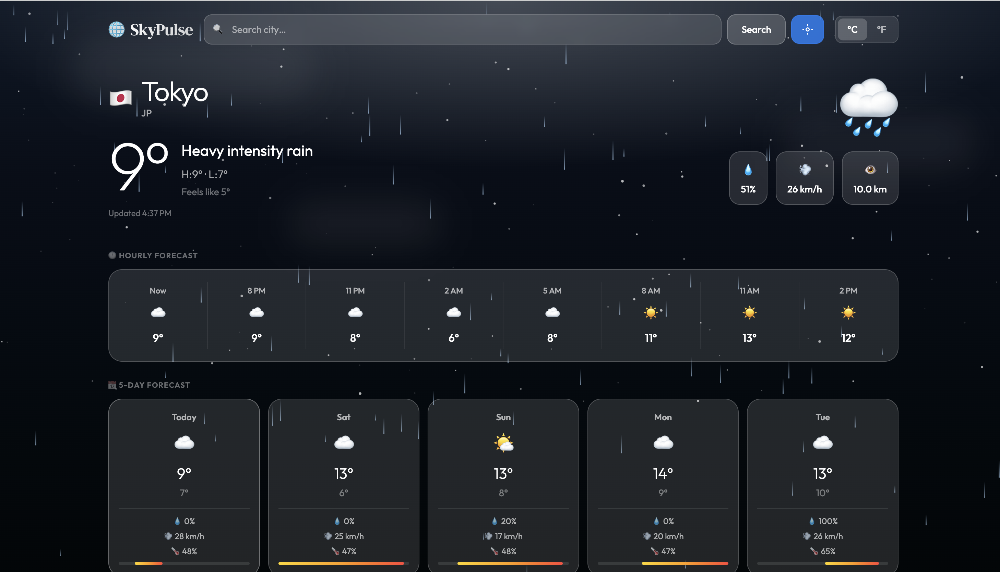
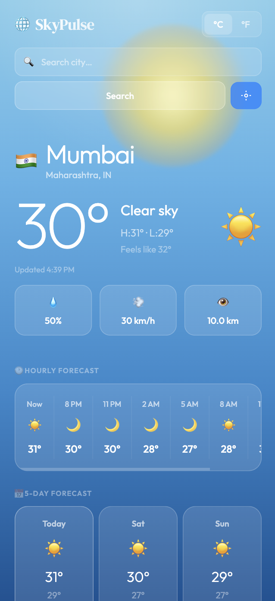

# 🌤️ SkyPulse Weather App

SkyPulse is a modern and responsive weather application that allows users to search for any city and view real-time weather conditions along with detailed forecasts.

The app provides current temperature, humidity, wind information, sunrise/sunset times, and a 5-day forecast with a clean and dynamic UI. Background visuals adapt to different weather conditions to enhance the user experience.

This project was built to practice **JavaScript, API integration, Tailwind CSS, and responsive UI design**.

---

# 🚀 Live Repository

GitHub Repository:
https://github.com/mohammad-umair32/skypulse-weather-app

---

# ✨ Features

🌍 Search weather by city name
📍 Get weather using your current location
🌡️ Current temperature with **feels-like temperature**
🌬️ Wind speed and wind direction
💧 Humidity and atmospheric pressure
🌅 Sunrise and sunset information
⏱️ Hourly weather forecast
📅 5-day weather forecast
🎨 Dynamic animated background based on weather
🕘 Recent search history dropdown
📱 Fully responsive for mobile, tablet, and desktop
⚡ Fast API requests using parallel fetch calls

---

# 🛠️ Tech Stack

### Frontend

* HTML5
* CSS3
* JavaScript (Vanilla JS)

### Styling

* Tailwind CSS

### Icons

* Font Awesome

### Weather API

* OpenWeatherMap API

---

# 📂 Project Structure

```
skypulse-weather-app
│
├── src
│   │
│   ├── index.html
│   ├── script.js
│   ├── input.css
│   └── output.css
│
├── .gitignore
├── package.json
├── package-lock.json
├── tailwind.config.js
```

### Explanation

**index.html**
Main HTML structure of the application.

**script.js**
Handles:

* API requests
* UI updates
* weather data processing
* search functionality
* background animations.

**input.css**
Tailwind source styles.

**output.css**
Compiled Tailwind CSS used in the app.

**tailwind.config.js**
Tailwind configuration file.

---

# ⚙️ Installation & Setup

### 1️⃣ Clone the repository

```bash
git clone https://github.com/mohammad-umair32/skypulse-weather-app.git
```

---

### 2️⃣ Navigate into the project

```bash
cd skypulse-weather-app
```

---

### 3️⃣ Install dependencies

```bash
npm install
```

---

### 4️⃣ Run Tailwind build

```bash
npm run build
```

This will generate the compiled CSS file.

---

### 5️⃣ Open the project

Open the file:

```
src/index.html
```

in your browser.

Or run with a local development server.

---

# 🔑 API Setup

This project uses **OpenWeatherMap API**.

### Steps:

1. Create an account at
   https://openweathermap.org/

2. Generate your API key.

3. Replace the API key inside:

```
script.js
```

Example:

```javascript
const OWM_KEY = "YOUR_API_KEY";
```

---

# 🧠 How the App Works

The application sends requests to the **OpenWeatherMap API** to fetch:

* Current weather data
* 5-day / 3-hour forecast data

The forecast data is processed using JavaScript to:

* Group forecast entries by day
* Calculate daily minimum and maximum temperatures
* Determine rain probability
* Display summarized daily forecasts

The UI then updates dynamically with the new weather information.

---
## 📷 Screenshots

### Desktop View

<p align="center">
  
</p>

### Mobile View

<p align="center">
  
</p>

# 🌤️ SkyPulse Weather App

SkyPulse is a modern and responsive weather application that allows users to search for any city and view real-time weather conditions.

## 🌐 Live Demo

https://skypulse3.netlify.app

# 📈 Future Improvements

Some features planned for future updates:

🌙 Dark / Light mode toggle
📊 Weather charts and analytics
🌍 Map-based weather search
🔔 Severe weather alerts
💾 Persistent search history using LocalStorage
📡 Weather caching for faster loading

---

# 👨‍💻 Author

**Mohammad Umair**

🎓 BSc IT Graduate
💻 Aspiring Frontend Developer

GitHub:
https://github.com/mohammad-umair32

---

# 📄 License
This project is open-source and available under the **MIT License**.
